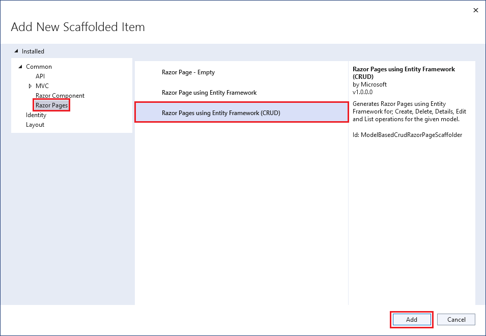

The following tutorial is based on [*"Get started with Razor Pages in ASP.NET Core"*](https://docs.microsoft.com/aspnet/core/tutorials/razor-pages/razor-pages-start) from docs.microsoft.com.

## Prerequisites

*  [Visual Studio 2022](https://visualstudio.microsoft.com/downloads/?wt.mc_id=adw-brand&gclid=Cj0KCQjwqYfWBRDPARIsABjQRYwLe3b9dJMixA98s8nS8QfuNBKGsiRVRXzB93fe4E27LGK5KLrGcnYaAgdREALw_wcB)
* In the Visual Studio Installer, install the following workload:
  * ASP.NET and web development

* Tutorial 1- [Create a Razor Page application](../1-Create%20a%20Razor%20Page/Create-a-Razorpage-VS.md)

## Add a data model

In this section, you are adding classes to manage movies in a database.

* In **Solution Explorer**, right-click the RazorPagesMovie project > **Add** > **New Folder**. Name the folder Models.
* Right click the Models folder. Select Add > Class. Name the class `Movie`.

## Add the following code to Movie.cs

```csharp
using System;

namespace RazorPagesMovie.Models
{
    public class Movie
    {
        public int ID { get; set; }
        public string Title { get; set; }
        public DateTime ReleaseDate { get; set; }
        public string Genre { get; set; }
        public decimal Price { get; set; }
    }
}

```

## Scaffold a Context class

* In Solution Explorer, right click on the Pages folder > Add > New Folder.
* Name the folder Movies
* In Solution Explorer, right click on the Pages/Movies folder > Add > New Scaffolded Item.
  


* In the Add Scaffold dialog, select Razor Pages using Entity Framework (CRUD) > Add.
  


### In the Add Razor Pages using Entity Framework (CRUD) dialog


* In the Model class drop down, select Movie (RazorPagesMovie.Models).
* In the Data context class row, select the + (plus) sign and set the name as RazorPagesMovie.Models.MovieContext.
* In the Data context class drop down, select RazorPagesMovie.Models.MovieContext.
* Select Add.

The generated code from the scaffold process creates the following files:

* Pages/Movies/
  * Create
  * Delete
  * Details
  * Edit
  * Index
* Data/MovieContext.cs: Class that includes a `DbSet` property for the entity set. An entity set typically corresponds to a database table, and entity corresponds to a row in the table.

The scaffold process also modifies existing files:

* Startup.cs: Created a DB context and registered it with the dependency injection container
* appsettings.json: The connection string used to connect to a local database is added.

#### Perform initial migration

* From the Tools menu, select **NuGet Package Manager** > **Package Manager Console**.


* In the Package Manager Console enter the following commands:

```
Add-Migration Initial
Update-Database
```

#### Test your app
* Press F5 to run the app
* Append /movies to the URL in the browser: http://localhost:port/movies


* Create a new entry with the Create link


* It works!


* Test the Edit, Details and Delete links
  
If you get a SQL exception, verify you have run migrations and updated the database.

**Extra light read 7 minutes**: If you want to read more on pages we just created [click here for more information](https://docs.microsoft.com/aspnet/core/tutorials/razor-pages/page).

**NEXT TUTORIAL** - [Modifying generated pages](../3-Update%20Pages/update-VS.md)
