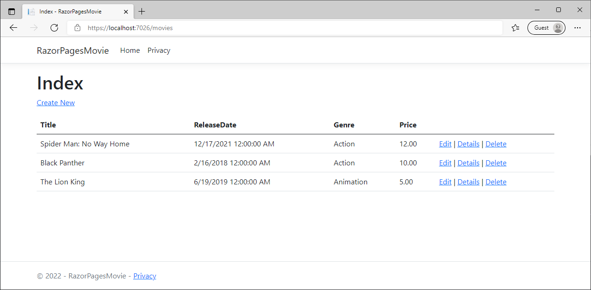

# Update pages in Visual Studio Code

The following tutorial is based on [*"Get started with ASP.NET Core Razor Pages in Visual Studio Code"*](https://docs.microsoft.com/aspnet/core/tutorials/razor-pages-vsc/razor-pages-start) from docs.microsoft.com.

## Prerequisites

* [.NET 6 SDK](https://dotnet.microsoft.com/download/dotnet/6.0) 
*  [Visual Studio Code](https://code.visualstudio.com/?wt.mc_id=adw-brand&gclid=Cj0KCQjwqYfWBRDPARIsABjQRYwLe3b9dJMixA98s8nS8QfuNBKGsiRVRXzB93fe4E27LGK5KLrGcnYaAgdREALw_wcB)
* Tutorial 1- [Create a Razor Page application](../1-Create%20a%20Razor%20Page/Create-a-Razorpage.md)
* Tutorial 2- [Add a Model](../2-Add%20a%20model/Addamodel.md)

## Update generated Pages



In this tutorial, you are going to learn how to update the generated pages. For example, suppose you want to remove the time from the release date.

* Open Models/Movie.cs
* Add this using statement: `using System.ComponentModel.DataAnnotations;` and `using System.ComponentModel.DataAnnotations.Schema;`
* Add the [following data annotations](https://docs.microsoft.com/aspnet/mvc/overview/older-versions/mvc-music-store/mvc-music-store-part-6):
`[Display(Name = "Release Date")]` and `[DataType(DataType.Date)]` as shown below:

``` cs
using System.ComponentModel.DataAnnotations;
using System.ComponentModel.DataAnnotations.Schema;
namespace RazorPagesMovie.Models;

public class Movie
{
    public int ID { get; set; }
    public string? Title { get; set; }

    [Display(Name = "Release Date")]
    [DataType(DataType.Date)]
    public DateTime ReleaseDate { get; set; }
    
    public string? Genre { get; set; }

    [Column(TypeName = "decimal(18, 2)")]
    public decimal Price { get; set; }
}
```
- run the app to see the update `dotnet run`


**NEXT TUTORIAL** :[Adding search](../4-Add%20Search/SearchPage.md)
