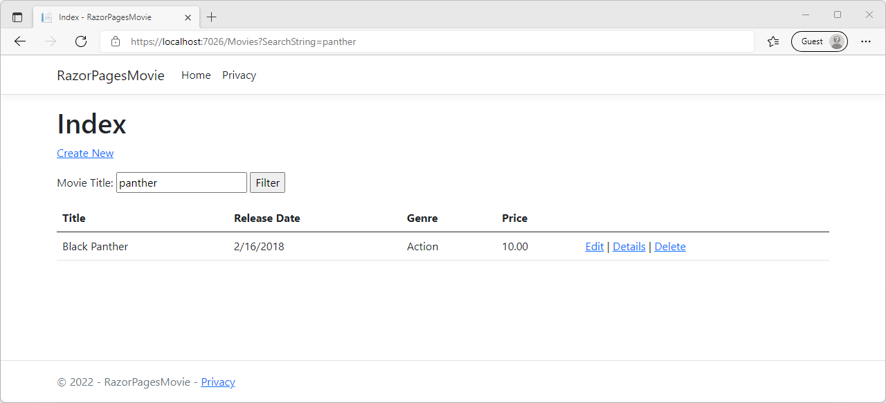
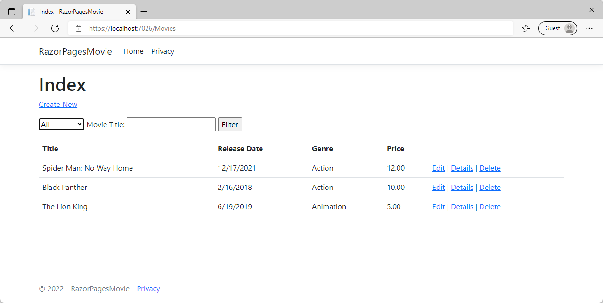

The following tutorial is based on [*"Get started with Razor Pages in ASP.NET Core"*](https://docs.microsoft.com/aspnet/core/tutorials/razor-pages/razor-pages-start) from docs.microsoft.com.

## Prerequisites

* [Visual Studio 2022](https://visualstudio.microsoft.com/downloads/?wt.mc_id=adw-brand&gclid=Cj0KCQjwqYfWBRDPARIsABjQRYwLe3b9dJMixA98s8nS8QfuNBKGsiRVRXzB93fe4E27LGK5KLrGcnYaAgdREALw_wcB)
* In the Visual Studio Installer, install the following workloads:
  * ASP.NET and web development

* Tutorial 1- [Create a Razor Page application](../1-Create%20a%20Razor%20Page/Create-a-Razorpage-VS.md)
* Tutorial 2- [Add a Model](../2-Add%20a%20model/Addamodel-VS.md)
* Tutorial 3- [Update Page](../3-Update%20Pages/update-VS.md)

## Adding Search to a page

In this tutorial, you are going to search to the Index Page. By the end of this tutorial, you can search by genre and name.

### Open Pages/Movies/Index.cshtml.cs and replace OnGetAsync with the following

```csharp
public async Task OnGetAsync(string searchString)
{
    var movies = from m in _context.Movie
                 select m;

    if (!String.IsNullOrEmpty(searchString))
    {
        movies = movies.Where(s => s.Title.Contains(searchString));
    }

    Movie = await movies.ToListAsync();
}
```

### Test search string

* Run your application again with F5 and navigate back to the Movies Page
* Append the query string to the end `?searchString=[Film Title]` (for example: `http://localhost:{port}/Movies?searchString=avengers`)


### Add a Search Box

**Search by Title**

#### Open the Pages/Movies/Index.cshtml file and add the`<form>`

```csharp
<h2>Index</h2>

<p>
    <a asp-page="Create">Create New</a>
</p>
<form>
    <p>
        Movie Title:<input type="text" name="SearchString">
         <input type="submit" value="Filter"/>
    </p>
</form>
```

* Run the application with F5
* Enter a film title



**Search by Genre**

### Add the code below to Pages/Movies/Index.cshtml.cs

*Note: you will need to add `using Microsoft.AspNetCore.Mvc.Rendering;`*

```csharp
public class IndexModel : PageModel
{
    private readonly RazorPagesMovie.Models.MovieContext _context;

    public IndexModel(RazorPagesMovie.Models.MovieContext context)
    {
        _context = context;
    }

    public IList<Movie> Movie;
    public SelectList Genres;
    public string MovieGenre { get; set; }
```

### Update `OnGetAsync` method

```csharp
public async Task OnGetAsync(string movieGenre,string searchString)
        {
            IQueryable<string> genreQuery = from m in _context.Movie
                                    orderby m.Genre
                                    select m.Genre;

            var movies = from m in _context.Movie
                        select m;

            if (!String.IsNullOrEmpty(searchString))
            {
                movies = movies.Where(s => s.Title.Contains(searchString));
            }

            if (!String.IsNullOrEmpty(movieGenre))
            {
                movies = movies.Where(x => x.Genre == movieGenre);
            }
            Genres = new SelectList(await genreQuery.Distinct().ToListAsync());
            Movie = await movies.ToListAsync();
        }
```

### Update Index.cshtml

```
<form>
    <p>
        <select asp-for="MovieGenre" asp-items="Model.Genres">
            <option value="">All</option>
        </select>
        
        Movie Title:<input type="text" name="SearchString">
         <input type="submit" value="Filter"/>
    </p>
</form>
```

* Run the application with F5



Mission Accomplished


You've have built your first Razor Page application!